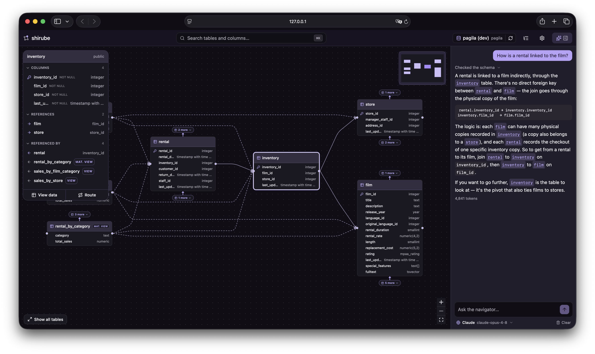

<p align="center">
  
</p>

<h1 align="center">shirube</h1>

<p align="center">
  <strong>スキーマに、道しるべを。</strong><br />
  <sub>標べ (<em>shirube</em>) は、データベースを関係の地図として読み解くためのツールです。</sub>
</p>

<p align="center">
  <a href="https://github.com/shou-taro/shirube/actions/workflows/ci.yml"></a>
  <a href="https://pypi.org/project/shirube/"></a>
  <a href="https://pypi.org/project/shirube/"></a>
  <a href="https://github.com/astral-sh/ruff"></a>
  <a href="LICENSE"></a>
  
</p>

<p align="center">
  <a href="README.md">English</a> | <strong>日本語</strong>
</p>

> 🚧 **現在はベータ版です。** ER 図での探索も AI ナビゲーターもすでに使えます。ただし正式リリース（1.0）の前なので、仕様や画面はまだ変わることがあります。今後の予定は [ロードマップ](#-ロードマップ) をご覧ください。

<p align="center"><em>話しかけるだけで、答えは地図に浮かぶ。</em></p>

<p align="center">
  
</p>

## 💡 shirube が必要な理由

アプリケーションコードで SQL を直接書く機会は、以前より少なくなっています。ORM やクエリビルダーを使えば、テーブル操作はモデルやメソッドとして扱えます。AI コーディングツールを使えば、その実装自体も AI が書いてくれる場面が増えました。

それでも、**DB スキーマを理解する必要がなくなるわけではありません。**

AI が書いた ORM のコードや SQL が正しいかを判断するには、そのコードがどのテーブルを見て、どのカラムを使い、どの関係をたどっているのかを把握する必要があります。AI にうまく依頼するときも、スキーマがある程度わかっていることが前提になります。

たとえば、こういったことは結局、人が自分で確かめることになります。

- 顧客情報はどのテーブルにあるのか
- 注文と支払いはどうつながっているのか
- このカラムはどのテーブルが持っているのか
- AI が出した JOIN やリレーションの使い方は自然なのか

テーブル一覧からひとつずつ開いていけば、カラムやデータは確認できます。ただ、DB スキーマを理解したいときに重要なのは、テーブル同士の関係です。あるテーブルが何を参照していて、逆にどこから参照されているのか。どの関係をたどると目的のデータに近づけるのか。

shirube は、DB をテーブルの一覧ではなく、**関係をたどれる地図** として見せます。

> AI は「SQL を誰が書くか」を変えた。shirube は「データベースをどう読むか」を変えたい。

## 🎯 shirube にできること

shirube は、DB スキーマを ER 図として表示するツールです。そこからテーブル同士の関係をたどり、テーブルの詳細や実データもその場で確認できます。

- 🗺️ **自分でたどる** — 気になるテーブルを検索して起点にし、そこから隣り合うテーブルへ、関係を一つずつたどっていけます。
- 🤖 **AI に聞く** — SQL を書かずに、知りたいことをそのまま質問すると、AI ナビゲーターがスキーマを読みながら案内し、関係するテーブルを ER 図上で示します。

shirube は、たとえば次のような問いに答えるために作っています。

- **このデータはどこにある？**
- **この二つのテーブルはどうつながっている？**
- **この外部キーはどこへ向かっている？**
- **どのテーブルから見始めればよい？**

shirube は SQL IDE でも、DB 管理ツールでもありません。クエリエディタはなく、データを書き換える機能もありません。目的は、DB スキーマを読み解くことです。

> 目標は「SQL を書かせない」ことではありません。**迷わず理解できるようにする**ことです。

## ✨ 主な機能

以下は、現在のベータ版で使える機能です。

- 🤖 **AI ナビゲーター** — 「顧客のメールアドレスはどこにある？」「注文と支払いはどうつながっている？」といった質問に、AI がスキーマを見ながら答えます。回答に出てくるテーブル名はリンクになっており、クリックすると ER 図上の該当箇所へ移動できます。Claude / OpenAI の API キー、または Ollama などのローカルモデルが使えます。[詳しくは後述](#-ai-ナビゲーター)。
- 🗺️ **まず ER 図が開く** — データベースに接続すると、テーブルやビューの関係を読み取り、ER 図として表示します。すべてのテーブルを一度に大きく出すのではなく、中心になるテーブルとその周辺から表示するため、大きな DB でも関係を追いやすくしています。
- 📋 **テーブル詳細** — カラムの型、主キー、NULL 可否、参照関係を確認できます。ER 図で関係を見ながら、気になったテーブルの情報をその場で読めます。
- 🔗 **クリックで関係をたどる** — 関連テーブルをクリックすると、そのテーブルを中心に表示が切り替わります。周辺の関係を少しずつたどりながら、目的のデータに近づけます。
- ✏️ **自分でリレーションを引く** — 外部キーが宣言されていないと、本来つながるはずのテーブルも地図上で散らばりがちです。そんなときは、列と列を結んで足りないつながりを自分で引けます（点線で表示）。引いたリンクは接続ごとに保存され、データベース本体には触れません。
- 🌳 **スキーマツリー** — スキーマ、テーブル、ビュー、カラムをツリー形式で一覧できます。検索や ER 図だけでは追いにくい大きな DB でも、全体像をつかみやすくなります。
- 👁️ **データプレビュー** — テーブルやビューの実データを読み取り専用で確認できます。カラムごとのソート、簡単なフィルタ、ページ送りに対応しています。
- ⚡ **すばやく検索** — <kbd>⌘K</kbd> / <kbd>Ctrl K</kbd> で、テーブル名やカラム名を検索し、目的の場所へ移動できます。
- 🔐 **接続を保存** — 複数の PostgreSQL 接続を管理できます。パスワードは設定ファイルではなく、OS のキーチェーンに保存します。
- 🌗 **ライト / ダークテーマ** — 好みや周囲の明るさに合わせて、表示を切り替えられます。

## 🤖 AI ナビゲーター

AI ナビゲーターは、DB スキーマを読み解くための案内役です。SQL を生成して実行する機能ではありません。

たとえば、次のような質問ができます。

- *「顧客のメールアドレスはどこにある？」*
- *「注文と支払いはどうつながっている？」*
- *「このテーブルはどこから参照されている？」*
- *「認証に関係するテーブルはどれ？」*

ナビゲーターはスキーマの情報を読み取り、関係するテーブルを ER 図上で示しながら説明します。回答に出てくるテーブルやビューの名前はリンクになっているため、文章を読んで終わりではなく、そのまま ER 図の該当箇所へ移動できます。

使うモデルは自分で選べます。**Settings → AI navigator** から、Claude や OpenAI の API キー、または Ollama などのローカルモデルを設定できます。AI ナビゲーターを使うかどうかは自由で、設定しなくても ER 図・検索・テーブル詳細・データプレビューはそのまま使えます。

## 🛡️ 安全は設計から

shirube は、DB スキーマや実データを見るためのツールです。だからこそ、安心して触れることを大切にしています。

- 🔒 **読み取り専用** — 接続は読み取り専用で開き、1 回のクエリが長く走り続けないよう実行時間にも上限を設けます。データの書き込みやスキーマ変更は行いません。
- 💻 **ローカルファースト** — shirube は手元のマシンで起動し、ブラウザから `127.0.0.1` にアクセスして使います。DB の接続情報や実データが、手元のマシンの外へ送り出されることはありません。
- 📝 **ログは診断に必要な情報だけ** — ローカルログにはエラーや処理時間などを記録します。データ行の値をログに書き出すことはありません。
- 🤖 **送り先は自分で選ぶ** — リモートのモデルを使うときは、必要なスキーマの情報（テーブルや列、関係など）だけが、手元のマシンから選んだプロバイダへ直接送られます。その通信を shirube が中継することはありません。ローカルモデルなら、ナビゲーターの処理も手元だけで完結します。

本番 DB に接続する場合は、`CONNECT` と `SELECT` だけを持つ読み取り専用ロールを使うことをおすすめします。

## 🚀 使ってみる

shirube は Python パッケージとして配布しています。次のいずれかのコマンドで、インストールせずにそのまま実行できます。

```bash
pipx run shirube
# または
uvx shirube
```

> [!NOTE]  
> `pipx` と `uvx` は、Python 製のコマンドラインツールを隔離された環境で実行できる仕組みです（`uvx` は [uv](https://docs.astral.sh/uv/) に付属）。shirube を常設インストールせずに試せます。

コマンドを実行すると、shirube が起動し、ブラウザで自動的に開きます。あとは接続するだけです。

1. PostgreSQL の接続情報を入力して接続する。
2. shirube がスキーマを読み取り、ER 図が表示される。
3. テーブルを検索したり、関係をたどったりして、目的のデータを探す。

接続先は、ローカルでもリモートでも構いません。

### 🧪 サンプルデータベースで試す

手元に試せる PostgreSQL がない場合は、Docker でサンプル DB を起動できます。このリポジトリには pagila、chinook、lego、employees、AdventureWorks のサンプルを用意しています。

```bash
git clone https://github.com/shou-taro/shirube.git
cd shirube
./scripts/dev-db.sh up
```

一部だけ起動したい場合は、名前を指定します。

```bash
./scripts/dev-db.sh up chinook lego
```

各サンプルは `127.0.0.1:5432` 上の別々のデータベースとして読み込まれます。利用できるサンプルは次のコマンドで確認できます。

```bash
./scripts/dev-db.sh list
```

## 🛣️ ロードマップ

まずは PostgreSQL 向けに、ER 図で DB スキーマを読み解く基本機能と、AI ナビゲーターを中心に開発を進めています。

今後は、PostgreSQL 以外の DB への対応、ER 図の見せ方の改善、保存できるマップレイアウト、UI の日本語化を含むローカライズなどを進めたいと考えています。

## 🤝 コントリビュート

ソースからの起動方法、プロジェクト構成、テストや lint の実行方法は [`CONTRIBUTING.md`](CONTRIBUTING.md) にまとめています。

## 📄 ライセンス

shirube は [GNU Affero General Public License v3.0](LICENSE)（AGPL-3.0）で公開されています。

著作権者が単独であるため、AGPL-3.0 を採用しにくい組織向けに、将来的に商用ライセンスを提供する可能性があります。
