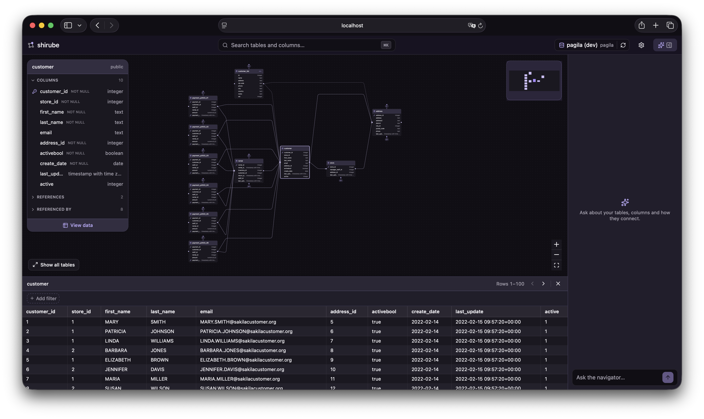

<p align="center">
  
</p>

<h1 align="center">shirube</h1>

<p align="center">
  <strong>標べ</strong> — a guide, a signpost.<br />
  Read and understand an unfamiliar database as a map, not a pile of tables.
</p>

<p align="center">
  <a href="https://github.com/shou-taro/shirube/actions/workflows/ci.yml"></a>
  
  <a href="LICENSE"></a>
  
</p>

> **Status: Beta.** The explorer core is here and usable today. The AI navigator — the
> feature shirube is ultimately built around — is the next milestone (see the
> [roadmap](#roadmap)). shirube is pre-1.0: things may still change.

<p align="center">
  
</p>

## Built for the AI-coding era

You write less SQL by hand than you used to — an AI writes much of it for you. But that
SQL still runs against **your** schema, and someone still has to understand that schema:
to prompt the AI well, to check what it gave back, to reason about where the data
actually lives. That understanding used to come for free while you wrote the queries
yourself. It doesn't any more.

shirube is where that understanding lives. It opens on an interactive ER diagram and
lets you explore a database like a map — search for a table, focus on it, and follow its
relationships outward — so you can see how everything connects without reading DDL or
writing a single query.

The goal was never *"don't write SQL."* It's **"don't get lost."** shirube helps answer:

- Where does this data live, and which table owns this column?
- How are these two tables related? Where does this foreign key lead?
- Which table should I even start from?

It is just as useful the classic way — dropping into a project with hundreds of
undocumented tables and needing to find your footing fast. shirube is **not** a SQL IDE
or a database administration console; it is a tool for *understanding* a database.

## Features

Everything below works today, in the beta:

- **ER diagram home.** shirube generates the diagram automatically and centres it on the
  most-connected table. You see a table and its immediate neighbours — not a wall of
  hundreds — and travel outward one hop at a time.
- **Table detail.** Columns with their types, primary keys and nullability, plus
  relationships split into *references* and *referenced by* — including the tables a view
  reads from.
- **Relationship navigation.** Click a related table to glide the map over to it, and
  keep following the connections.
- **Data preview.** Read a table or view's actual rows in a drawer beneath the map, with
  click-to-sort columns, simple column filters, and paging.
- **Instant search.** Press <kbd>⌘K</kbd> / <kbd>Ctrl K</kbd> to jump straight to any
  table or column.
- **Saved connections.** Manage several PostgreSQL profiles; passwords are kept in your
  operating system's keychain, never in a config file.
- **Light and dark themes.**

## Safe by design

shirube is meant never to feel dangerous.

- **Read-only.** Every connection is opened read-only with a statement timeout. shirube
  cannot modify your database — no writes, no schema changes, ever.
- **Local-first.** It runs on your machine and binds to `127.0.0.1` only. Your database
  credentials and data never leave your computer; passwords live in the OS keychain.
- **Metadata-only logging.** The local log records what is needed to diagnose a problem
  (errors, request timings) but never the values in your data.

## Getting started

**Requirements:** a reachable PostgreSQL database, and [uv](https://docs.astral.sh/uv/)
(which provides `uvx`).

```bash
uvx shirube
```

That starts a local server and opens shirube in your browser. Add a connection to your
PostgreSQL database and you're exploring — the database can be local or remote.

> shirube connects with whatever credentials you give it; a read-only role with
> `CONNECT` and `SELECT` is all it needs, and all it should have.

## Roadmap

shirube's development runs in three phases.

- **Now — Explore (beta).** The ER diagram, table detail, relationship navigation, data
  preview and search described above.
- **Next — the AI navigator.** Ask, in plain language, where data lives and how tables
  connect, and let the guide lead you there. The AI is a *navigator*, not a SQL
  generator, and it never changes anything. This is the headline feature still to land.
- **Later — Analyse & Manage.** Richer GUI filters and aggregation, saved views,
  AI-suggested relationships and semantic search; then safe, GUI-driven editing and
  team / self-hosted features. MySQL and SQL Server will follow PostgreSQL.

## Contributing

Running shirube from source, the project layout and the checks are documented in
[`CONTRIBUTING.md`](CONTRIBUTING.md).

## Licence

shirube is licensed under the
[GNU Affero General Public License v3.0](LICENSE) (AGPL-3.0).

As sole copyright holder, the project may additionally be offered under a commercial
licence in future (dual-licensing) for organisations that cannot use AGPL-3.0.
